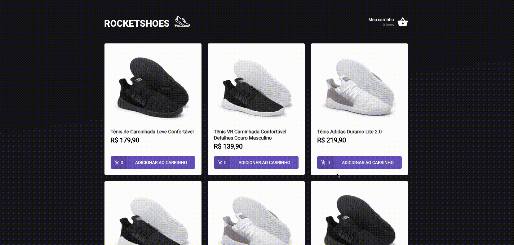

<h1 align="center" >
  <br>
    
  <br>
</h1>

<p align="center">An ReactJS application for shopping cart</p>

<p align="center">
   <a href="https://github.com/gustavonobrega">
    
   </a>
</p>

<p align="center">
  
</p>

<hr />

## 🚀 Technologies

This project was developed with the following technologies:

- [JSON Server](https://github.com/typicode/json-server)
- [ReactJS](https://reactjs.org/)
- [TypeScript](https://www.typescriptlang.org/)
- [React Router DOM](https://reacttraining.com/react-router/)
- [React Icons](https://react-icons.netlify.com/#/)
- [React Toastify](https://fkhadra.github.io/react-toastify/introduction)
- [Styled Components](https://styled-components.com/)
- [Polished](https://github.com/styled-components/polished)
- [Axios](https://github.com/axios/axios)


## 💻  Getting started

_Before you run this application you need to make sure the `yarn server` is running!_.

```bash
# Clone this repository
$ git clone https://github.com/gustavonobrega/ignite-challenge-shopping-cart-hook

# Go into the repository
$ cd ignite-challenge-shopping-cart-hook

# Install dependencies
$ yarn

# Run the app
$ yarn start
```

---

Made with ♥ by Gustavo Nobrega